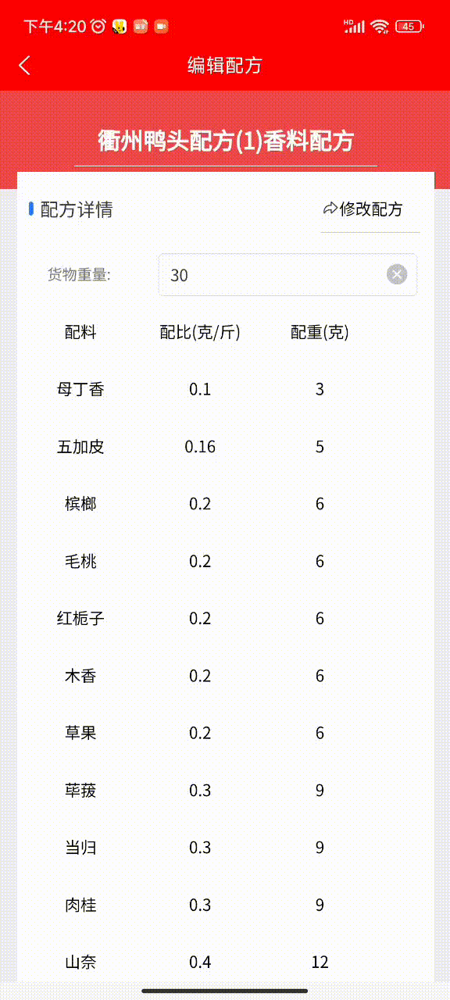
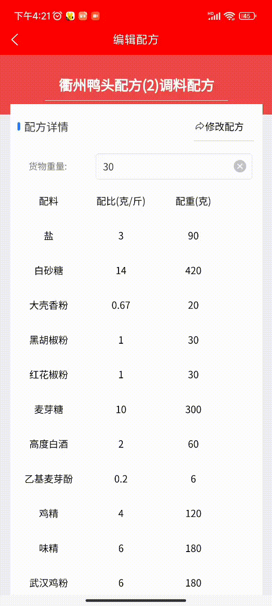

> 下面以卤制10斤鸭货为例，制作老汤和卤制鸭货，用户根据自己的需求等比例增加或缩小食材的重量即可。

完整的衢州鸭头技术包括老汤的制作、鸭货的预处理、配料和鸭货的卤制。

# 制作老汤
卤制鸭货之前，首先要制作老汤。制作老汤包括准备食材、焯水、熬制老汤和养汤四步。

## 准备食材
卤制鸭货时，卤汤和鸭货的比例一般是1.5:1，所以要卤制10斤鸭货，需要制作15斤的老汤。

下面是制作15斤卤汤要准备的食材：
- 猪棒骨、鸡架、猪皮：5斤（卤水多的话放入一只老母鸡）
- 清水：25斤（食材重量 * 3 + 10）
- 甜面酱：120克
- 豆瓣酱：120克
- 大豆油：825克
- 10斤的香料包一副(下文有详细的香料配方)
- 麦芽糖：450克
- 糖色：750克
- 鸡粉：270克
- 盐：135克

## 焯水
在熬制老汤前，先对食材焯水。
1. 锅中倒入适量清水（没过食材）；
2. 将猪棒骨、鸡架、猪皮等食材放入锅中；
3. 开火；
4. 锅开后沸腾两分钟；
5. 将猪棒骨、鸡架、猪皮等食材捞出，并清洗干净；
6. 将锅中的水倒出。

## 熬制老汤
焯水后，就可以开始熬制老汤了。
1. 锅中加入前文中指定重量的清水；
2. 将猪棒骨、鸡架、猪皮等食材放入锅中；
3. 开火，烧水，并将过程中产生的浮沫打出；
4. 烧开后调小火，熬制7小时，直到锅中的食材骨肉分离、汤的颜色为乳白色；
5. 将食材全部捞出，开盖自然放凉。
> 如果食材过多，熬制过程中经常搅拌搅拌，防止糊底！

## 养汤
刚熬制出来的老汤是不能卤货的，需要养一次才能卤货。
1. 将汤表面的浮油捞出；
2. 大火烧开；
3. 放入乙基麦芽酚，大火烧开，此时汤逐渐发黄；
4. 加入糖色、麦芽糖、豆瓣酱、甜面酱，烧至大开；
5. 放入大豆油，烧至大开；
6. 放入香料（辣锅还需放入辣椒和花椒），烧至大开；
7. 转中小火，煮20分钟；
8. 放入糖、盐、鸡粉，煮30分钟；
9. 放入鸭边腿和鸡翅尖（共10斤，放入前需要解冻并泡出血水）；
10. 大火烧开，转中小火，煮3个小时；
11. 用密漏将食材、香料等打捞干净；
12. 这时候，衢州鸭头的老汤就制作完成了。

> 温馨提示：熬制好的老汤是枣红色或深红色，可通过糖色调整。

# 鸭货的预处理
鸭货在卤制之前需要进行预处理，包括解冻和改刀。
## 解冻
鸭货生货都是冷冻的，在卤制之前需要用冷水浸泡8小时以上，直到将血水完全泡出来。
## 改刀
鸭货解冻后，有些鸭货还需要改刀处理。

**鸭头**：用刀将鸭头下巴划开，然后用喷水枪将血水冲出来。

**鸭腿**：在鸭腿上划出两道口子，以便于入味。有些鸭腿毛没有处理干净，还需要用火枪把毛烧掉。

**鸭胗**：在鸭胗两侧的中间，各划一道口子。

**猪蹄**：用火枪将毛烧掉。

其它鸭货如无特殊情况，泡完血水后，不用特殊处理，可以直接下锅卤制。
# 配料
衢州鸭头的配料分为两个部分：香料和调料。香料指的是人们常说的衢州鸭头核心配方，如八角、茴香等。调料指的是调味料，如盐、鸡精、味精等。

## 香料配方
下面是卤制10斤鸭货的香料配方：

以上图片截自**餐谋长APP**，如果卤制的鸭货重量不同， 可以下载**餐谋长APP**，在【免费市场】->【配方市场】里找到【衢州鸭头香料配方】，输入卤制货物的重量，即可得出每种香料的配重。

**注意：香料配好后，需要清洗干净。用开水泡10分钟，清洗干净即可。**
## 调味料配方
下面是卤制10斤鸭货的调味料配方：

以上图片截自**餐谋长APP**，如果卤制的鸭货重量不同， 可以下载**餐谋长APP**，在【免费市场】->【配方市场】里找到【衢州鸭头调料配方】，输入卤制货物的重量，即可得出每种调味料的配重。

# 卤制
卤制衢州鸭头的香料，可以重复使用3次，第一次用新香料，第二次和第三次使用旧香料+补充香料。所以，衢州鸭头的卤制分三锅来讲。

## 卤制第一锅鸭货
1. 将老汤烧开；
2. 按配方放入盐、白砂糖、大壳香粉、花椒粉、胡椒粉；
3. 烧至大开；
4. 按配方放入清洗后的香料包（如果是辣锅，还需要放入辣椒和花椒）；
5. 烧至大开；
6. 放入鸭脖、猪蹄、猪皮、兔头，烧至大开，计时15分钟；
7. 放入鸭头、鸭腿、白条鸭（若有）；
8. 放入白酒、麦芽糖，烧开锅，计时8分钟；
9. 放入锁骨，计时8分钟；
10. 放入鸭掌、鸭胗、乙基麦芽酚，计时10分钟；
11. 放入鸭翅、鸭心，计时14分钟；
12. 放入鸡爪、鸡翅尖、鸭食管、鸡精、味精、鸡粉，计时7分钟；
13. 关火焖20分钟；
14. 出锅。

注意：出锅时少量多次、从上到下的捞出，以免捞烂。
## 卤制第二锅鸭货
卤制第二锅前，把卤制第一锅的香料捡出备用，并补充以下香料：
- 八角：10克
- 香砂：15克
- 香菜籽：10克
- 白蔻：10克

辣锅还需要补充辣椒和花椒：
- 福建辣椒王：30克
- 四川大红袍：10克
> 注意：香料、辣椒、花椒都需要用开水泡10分钟并清洗干净。

下面的卤制流程就和第一锅的卤制流程完全一样了：
1. 将老汤烧开；
2. 按配方放入盐、白砂糖、大壳香粉、花椒粉、胡椒粉；
3. 烧至大开；
4. 按配方放入清洗后的香料包（如果是辣锅，还需要放入辣椒和花椒）；
5. 烧至大开；
6. 放入鸭脖、猪蹄、猪皮、兔头，烧至大开，计时15分钟；
7. 放入鸭头、鸭腿、白条鸭（若有）；
8. 放入白酒、麦芽糖，烧开锅，计时8分钟；
9. 放入锁骨，计时8分钟；
10. 放入鸭掌、鸭胗、乙基麦芽酚，计时10分钟；
11. 放入鸭翅、鸭心，计时14分钟；
12. 放入鸡爪、鸡翅尖、鸭食管、鸡精、味精、鸡粉，计时7分钟；
13. 关火焖20分钟；
14. 出锅。

注意：出锅时少量多次、从上到下的捞出，以免捞烂。

## 卤制第三锅鸭货
卤制第三锅前，把卤制第二锅的香料捡出备用，并补充以下香料：
- 八角：10克
- 香砂：15克
- 香菜籽：10克
- 白蔻：10克

辣锅还需要补充辣椒和花椒：
- 福建辣椒王：**50克**
- 四川大红袍：10克
> 注意：香料、辣椒、花椒都需要用开水泡10分钟并清洗干净。

下面的卤制流程就和第一锅的卤制流程完全一样了：
1. 将老汤烧开；
2. 按配方放入盐、白砂糖、大壳香粉、花椒粉、胡椒粉；
3. 烧至大开；
4. 按配方放入清洗后的香料包（如果是辣锅，还需要放入辣椒和花椒）；
5. 烧至大开；
6. 放入鸭脖、猪蹄、猪皮、兔头，烧至大开，计时15分钟；
7. 放入鸭头、鸭腿、白条鸭（若有）；
8. 放入白酒、麦芽糖，烧开锅，计时8分钟；
9. 放入锁骨，计时8分钟；
10. 放入鸭掌、鸭胗、乙基麦芽酚，计时10分钟；
11. 放入鸭翅、鸭心，计时14分钟；
12. 放入鸡爪、鸡翅尖、鸭食管、鸡精、味精、鸡粉，计时7分钟；
13. 关火焖20分钟；
14. 出锅。

注意：出锅时少量多次、从上到下的捞出，以免捞烂。

到这里，衢州鸭头技术的全部流程就讲完了，上面涉及到的配方，都可以从【餐谋长APP】或【餐谋长抖音小程序】中免费拿到，并可以根据自己卤货的重量自动计算出各香料和调料的配重。
