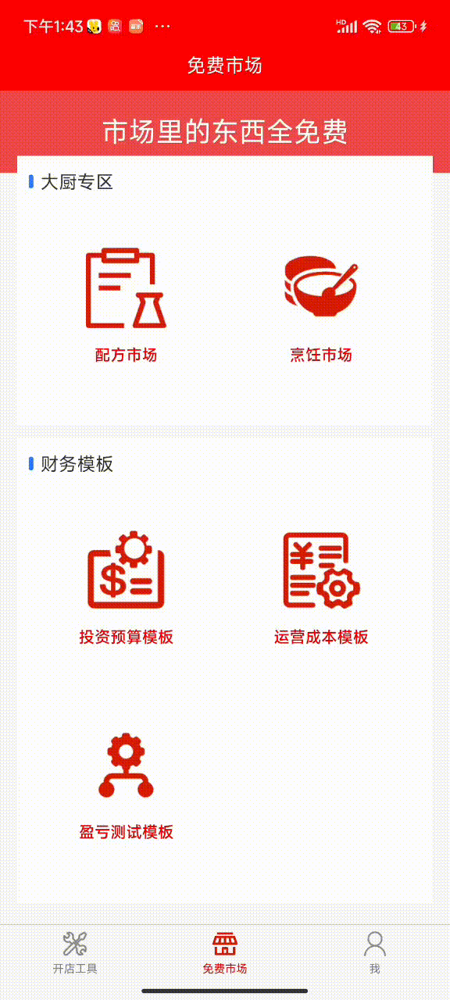

本文将分享五香猪头肉的商用做法。内容包括起卤汤、配香料包、生货的处理和猪头肉的卤制。

细节很多，请耐心看。
# 起卤汤
卤汤是卤制猪头肉的关键，猪头肉要卤的好吃，必须要有一锅好卤汤。本小结将讲解卤汤的制作方法。
## 一、准备食材
下面是制作70斤卤汤要准备的食材：
- 猪棒骨：15斤
- 新鲜鸡：15斤
- 新鲜鸭：15斤
- 肥猪肉：5斤
- 猪皮：5斤
- 料酒：500ml
- 香醋：20克
- 香料：一副（下文会详细说明香料配方）
- 姜：500克
- 葱：200克
- 清水：120斤
- 盐：1260克（每斤卤水18克）
- 味精：700克（每斤卤水10克）
- 白砂糖：560克（每斤卤水8克）
- 鸡精：280克（每斤卤水4克）
- 乙基麦芽酚：21克（每斤卤水0.3克）
- 糖色：700克（这里指的是冰糖/白砂糖的重量，每斤卤水10-15克）

## 二、预处理食材
在熬制老汤前，需要对肉类食材和香料包进行预处理。
1. 将所有肉类食材冷水解冻（新鲜食材不用）；
2. 跑出所有肉类食材的血水（冬天6小时以上，夏天2小时以上）；
3. 将所有肉类食材去毛、切块、焯水；
4. 香料包用温水浸泡半小时，并清洗干净。

## 三、熬制老汤
下面开始熬制老汤。
1. 往锅中倒入清水；
2. 加入备好的姜、大葱、料酒、香醋；
3. 下入准备好的棒骨、鸡、鸭、猪肉、猪皮（一定要冷水下锅）；
4. 用大火烧开，并用大火熬制1个小时；
5. 转中火，熬制1.5小时；
6. 将配好并清洗好的香料散放入高汤中，熬制半小时；
7. 加入糖色，熬制半小时；
8. 把锅中的食材全部打捞干净；
9. 加入调味料：盐、味精、糖、鸡精、乙基麦芽酚；
10. 最后，烧开锅后关火，老汤制作完成。
> 温馨提示：最后的高汤控制在70-80斤。

# 生货的预处理
猪头肉在卤制之前需要进行预处理，包括解冻、烧毛和焯水。
1. 解冻:如果使用的是冻货，需要用冷水解冻，并泡出血水;
2. 烧毛：很多猪货有毛剔除不干净的现象，需要用火枪把毛烧光；
3. 焯水：冷水下锅，开过后沸腾2分钟左右捞出，并清洗干净。

# 配料
猪头肉的配料分为两个部分：香料和调料。香料指的是人们常说的核心配方，如八角、茴香等。调料指的是调味料，如盐、鸡精、味精等。

## 香料配方
下面是80斤卤水的香料配方：

以上图片截自**餐谋长APP**，如果卤水重量不同， 可以下载**餐谋长APP**，在【免费市场】->【配方市场】里找到【五香猪头肉香料配方】，输入卤水的重量，即可得出每种香料的配重。

**注意：香料配好后，需要清洗干净。用开水泡10分钟，清洗干净即可。**
## 调味料配方
下面是卤制30斤猪头肉的调味料配方：

以上图片截自**餐谋长APP**，如果卤制重量不同， 可以下载**餐谋长APP**，在【免费市场】->【配方市场】里找到【五香猪头肉调料配方】，输入卤制货物的重量，即可得出每种调味料的配重。

# 卤制
卤制五香猪头肉的香料，可以重复使用3次。
> 温馨提示：刚制作好的卤汤味道不够厚重，卤制出的货物颜色较淡，建议先用低成本的食材(如鸡翅尖)卤1-2次，再正式卤制。

1. 静止状态下，保证卤油厚度在2厘米左右；
2. 开火烧锅，并打掉过程中的血沫；
3. 烧至大开，放入香料包；
4. 放入猪头肉（根据卤制的食材时长不同，依次下入）；
5. 放入盐、糖、白胡椒粉；
6. 过程中保持小火锅微开的状态；
7. 关火前15分钟放入鸡精、味精、乙基麦芽酚；
8. 关火焖15-20分钟，捞出香料包和食材。

大多数情况下，熟食店里会同时售卖猪头肉、护心肉、猪耳朵等猪肉类熟食，这些猪肉类熟食可以和猪头肉放在一起，一块卤制。需要注意的一点是每种食材的卤制时间是不一样的，可以根据卤制时间的不同，依次下入。下面是常见的猪肉类食材的卤制时间：
1. 猪头肉：55分钟；
2. 排骨：55分钟；
3. 耳朵：55分钟；
4. 肘子：55分钟；
5. 猪蹄：55分钟；
6. 猪尾巴：45分钟；
7. 肥肠：45分钟；

以上卤制时间仅供参考，每种食材的卤制时间还和食材的大小有关，实际卤制过程中还要以实践灵活调整。

到这里，五香猪头肉技术的全部流程就讲完了，上面涉及到的配方，都可以从【餐谋长APP】或【餐谋长抖音小程序】中免费拿到，并可以根据自己卤货的重量自动计算出各香料和调料的配重。

